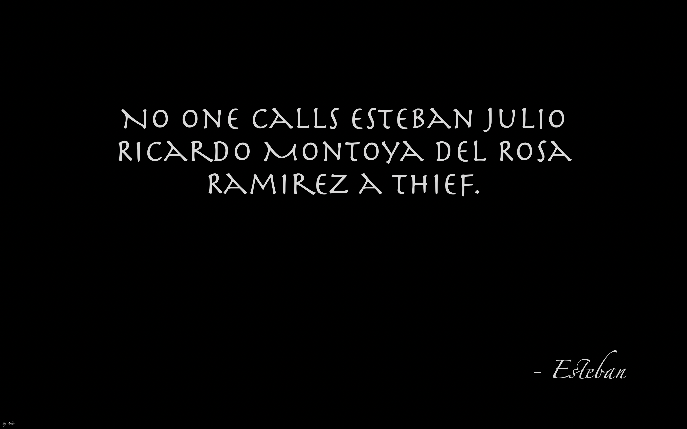

# QuoteSaver
A screensaver for MacOS that takes and shows quotes from a csv file.

The idea came from a personal list of quotes I started. I wanted those quotes to be shown somewhere, so I figured a screensaver would be the perfect solution.

QuoteSaver is a simple screensaver application programmed with Swift in Xcode 10. It reads the the csv file (as of the latest progress) from a static path, feeds it into an array and chooses a random element to show. It changes the quote every 5 minutes.

Preview:

